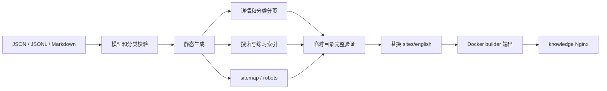

# 英语学习网站技术方案

本方案已按 2026-09-07 的追加需求实现：独立英语站、参考 LanGeek 的 UI、完整八类词表、随机背词，并获准提交推送和部署。

## 技术与目录

保留 Node.js ESM 静态生成、HTML、原生 JavaScript 和 CSS。构建期复用 VitePress 的 Markdown renderer、gray-matter、cheerio 与 PostCSS。无数据库、用户系统或外部词典运行时依赖。

| 目录/文件 | 职责 |
| --- | --- |
| content/english | 人工内容、词表分片、分类与来源记录 |
| scripts/english/model.mjs、types.d.ts | 类型、读取、分类与引用校验 |
| scripts/english/render.mjs | 独立站布局和页面组件 |
| scripts/english/assets | 样式、搜索、语音和抽词客户端 |
| scripts/generate-english.mjs | 所有路由、静态 HTML、索引、练习数据与 SEO |
| scripts/import-english-vocabulary.mjs | 固定来源校验、全词表导入与去重 |
| scripts/validate-english.mjs | 全量页面、链接、品牌、SEO 与索引验证 |
| sites/english | 不入 Git 的静态生成物 |
| deploy/nginx.conf、Dockerfile | 英语独立路由、404、gzip、builder 产物发布 |

## 数据模型

单词通过稳定 id 关联多个 levelIds/topicIds/tagIds，senses 组织词性、中文与可选英文和例句。英美 pronunciation 分开，variants 保存多读音，reference 明确表示未区分口音的参考音标。缺失字段不生成虚构内容。

大规模词汇按字母分成 JSONL，一行一词；精编词保留独立 JSON，二者不得重复。内容可按主题关联，不因所属阶段改变存储位置。分类树用 parentId 支持任意深度，父分类包含后代并去重。

语法一个主题目录包含公共 index.md 与不同深度 Markdown；阶段从深度层汇总，主题只有一个 canonical URL。表达一条一个 JSON，sceneIds 可同时属于工作、日常等场景。

来源与具体计数见 [内容指南](content/english/README.md)。公开来源覆盖完整，并保留 IPA 缺项报告，不将公开词表描述为官方唯一考试大纲。

## 页面和交互

首页只展示单词、语法、常用表达三个大分类，顶部保留小型搜索入口；内页保留英语站内导航和随机背词入口。站点只显示 English Learning，不出现 Dezhonger 品牌或其他 dezhonger.com 域名链接；当前域名仍用于 canonical/SEO。

主要 URL：

- /vocabulary、/vocabulary/level/cet6、/vocabulary/topic/fruit、/vocabulary/apple。
- /grammar、/grammar/level/primary、/grammar/category/tenses、/grammar/present-simple。
- /expressions、/expressions/parenting、/expressions/work/meetings、/expressions/item/could-you-give-me-a-hand。
- /vocabulary/practice、/search、/sources。

随机背词选择一个词表和 1–500 的整数，通过部分 Fisher–Yates 随机抽取，组内不重复。少于请求数量时返回全部可用词并明确说明。释义默认 hidden，单条按钮可展开；重新抽词清空揭晓状态。大组每页 25 个，分页不改变本组抽样。

语音始终朗读英文单词或句子，不朗读 IPA。统一服务选择 en-GB/en-US，缺声音时回退，连续播放取消前次。搜索和抽词数据按需加载，错误可重试；新请求有序号，避免旧请求覆盖当前结果。练习只维持当前页面状态，不引入长期学习进度系统。

## 生成与 SEO

每页生成独立 title/description/canonical/Open Graph，内容无需客户端渲染即可阅读。空分类和搜索页 noindex；sitemap 只列真实可索引页面。英语独立 Nginx 规则返回真实 404，代码与样式使用哈希缓存，首页禁止缓存。搜索和练习数据使用固定的版本化地址并重新验证；旧词库 URL 仅保留数据适配，不恢复旧页面。gzip 压缩大词表资源。

源码词表约 4.7MB，生成 HTML 约 126MB，因此只将内容源和生成器入 Git。Docker 忽略宿主生成目录，始终从 builder 复制重新生成的英语内容，避免发布旧产物。

## 检查与发布

执行源码/数据校验、22 项测试、英语生成验证、全站构建、浏览器交互、响应式和错误恢复。覆盖报告见 [验证记录](english-learning-validation.md)。

用户已明确授权提交、推送和服务器部署。发布只重建 knowledge，保留旧镜像并检查其他内容站点；不修改其他仓库或重启 api/db/nginx。

## 参考

- [LanGeek 首页](https://langeek.co/) 与 [词汇页](https://langeek.co/en/vocab)：实际 UI 参考，图形为本站原创 SVG。
- [ECDICT](https://github.com/skywind3000/ECDICT)：六类阶段/考试标签与中英词典。
- [Words with Toddlers](https://github.com/mysticcoders/words-with-toddlers)：Dolch 与 Fry 词表。
- [IPA Dict](https://github.com/open-dict-data/ipa-dict)：分口音 IPA。
- 源码基线：dezhonger-knowledge/main ef7648c0f4237e059443a450216321be34ec7057。
